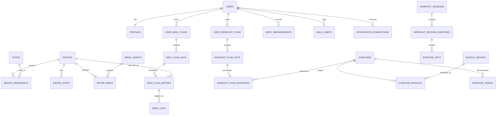

# FitForge v1.0 Data Model

## Design principles

- UUID primary keys for user-owned and externally referenced entities.
- Shared reference data may use UUIDs for consistency.
- Every user-owned table includes `user_id`.
- Store measurements in explicit units.
- Preserve historical plan and workout data rather than overwriting it.
- Treat media attribution and integration provenance as first-class data.
- Use timestamps with time zone.

## Core entity groups

### Identity

- `users`
- `sessions`
- `accounts`
- `verifications`
- `user_roles`

### Profile and preferences

- `profiles`
- `user_goals`
- `dietary_preferences`
- `user_dietary_preferences`
- `health_considerations`
- `user_health_considerations`
- `user_equipment`

### Nutrition reference

- `food_categories`
- `foods`
- `serving_units`
- `food_servings`
- `food_substitutions`
- `allergens`
- `food_allergens`

### Recipes

- `recipes`
- `recipe_ingredients`
- `recipe_steps`
- `recipe_tags`
- `recipe_tag_links`
- `recipe_media`
- `favourite_recipes`

### Meal planning

- `meal_plan_templates`
- `meal_template_days`
- `meal_template_entries`
- `user_meal_plans`
- `meal_plan_days`
- `meal_plan_entries`
- `meal_logs`
- `shopping_lists`
- `shopping_list_items`

### Exercise reference

- `exercise_categories`
- `muscle_groups`
- `equipment`
- `exercises`
- `exercise_muscles`
- `exercise_equipment`
- `exercise_media`
- `exercise_videos`

### Training

- `workout_plan_templates`
- `workout_template_days`
- `workout_template_exercises`
- `user_workout_plans`
- `workout_plan_days`
- `workout_plan_exercises`
- `workout_sessions`
- `workout_session_exercises`
- `exercise_sets`
- `strength_benchmarks`

### Progress and habits

- `body_measurements`
- `progress_photos`
- `daily_habits`
- `weekly_summaries`

### Integrations and governance

- `integration_connections`
- `integration_sync_jobs`
- `external_health_records`
- `media_assets`
- `audit_events`

## Key relationships

## Important columns

### `users`

- `id uuid pk`
- `email text unique`
- `display_name text`
- `role enum(user, admin)`
- `onboarding_completed_at timestamptz null`
- `created_at timestamptz`
- `updated_at timestamptz`

### `profiles`

- `user_id uuid unique fk`
- `height_cm integer`
- `starting_weight_kg numeric(6,2)`
- `timezone text`
- `locale text`
- `training_days_per_week integer`
- `preferred_training_time text`
- `protein_target_min_g integer`
- `protein_target_max_g integer`
- `water_target_ml integer`
- `step_target integer`
- `creatine_target_g numeric(4,1)`

### `foods`

- `name text`
- `slug text unique`
- `category_id uuid fk`
- `protein_g numeric`
- `carbohydrate_g numeric`
- `fat_g numeric`
- `fibre_g numeric`
- `energy_kcal integer`
- `reference_quantity numeric`
- `reference_unit text`
- `published boolean`

### `recipes`

- `owner_user_id uuid null`
- `name text`
- `slug text unique for shared recipes`
- `description text`
- `servings integer`
- `preparation_minutes integer`
- `cooking_minutes integer`
- `difficulty enum`
- `protein_g_per_serving numeric`
- `carbohydrate_g_per_serving numeric`
- `fat_g_per_serving numeric`
- `energy_kcal_per_serving integer`
- `publication_status enum(draft, published, archived)`

### `media_assets`

- `type enum`
- `url text`
- `source_url text`
- `creator_name text`
- `creator_url text`
- `licence_name text`
- `licence_url text`
- `attribution_text text`
- `last_verified_at timestamptz`
- `active boolean`

### `workout_sessions`

- `user_id uuid fk`
- `plan_day_id uuid null`
- `started_at timestamptz`
- `completed_at timestamptz null`
- `status enum(planned, active, completed, abandoned)`
- `notes text`

### `exercise_sets`

- `session_exercise_id uuid fk`
- `set_number integer`
- `target_reps_min integer null`
- `target_reps_max integer null`
- `completed_reps integer null`
- `weight_kg numeric null`
- `duration_seconds integer null`
- `completed boolean`

### `external_health_records`

- `user_id uuid fk`
- `provider enum`
- `record_type enum(steps, workout, weight, active_energy, heart_rate)`
- `external_id text`
- `recorded_at timestamptz`
- `value numeric`
- `unit text`
- `metadata jsonb`
- unique `(provider, external_id)`

## Index strategy

- Unique indexes on email, public slugs, and provider external IDs.
- Composite indexes on `(user_id, date)` for logs and measurements.
- Composite indexes on `(user_id, status)` for plans and sessions.
- Search indexes can be added later for recipe and food names.
- Foreign-key columns receive indexes where query patterns require them.

## Migration policy

- `db:push` is acceptable only during initial local prototyping.
- After the v1 baseline, use generated migrations committed to the repository.
- Never edit an applied production migration.
- Seed data must use stable slugs/keys and upserts.
- Preview and production databases must be separate.